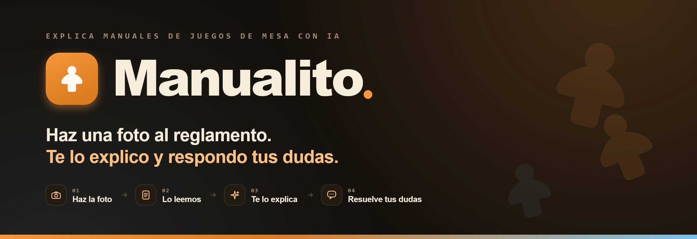

# Manualito



[](https://github.com/ibaimoya/tfg/actions/workflows/ci.yml)
[](https://sonarcloud.io/summary/new_code?id=ibaimoya_tfg)
[](https://sonarcloud.io/summary/new_code?id=ibaimoya_tfg)
[](https://sonarcloud.io/summary/new_code?id=ibaimoya_tfg)
[](https://sonarcloud.io/summary/new_code?id=ibaimoya_tfg)
[](https://sonarcloud.io/summary/new_code?id=ibaimoya_tfg)
[](https://sonarcloud.io/summary/new_code?id=ibaimoya_tfg)
[](https://www.python.org/downloads/)
[](https://fastapi.tiangolo.com)
[](https://www.docker.com/)
[](https://ollama.com)
[](https://www.trychroma.com/)
[](https://github.com/astral-sh/uv)
[](https://github.com/astral-sh/ruff)
[](LICENSE)
[](https://hpscds.com/en/innovation/technological-observatory/)

Manualito es una app web para subir manuales de juegos de mesa, extraer su texto
con OCR y convertirlos en explicaciones consultables por juego mediante RAG y un
modelo de lenguaje local. El objetivo es que aprender un juego deje de depender
de pelearse con un PDF largo, una foto borrosa o un reglamento poco amable.

El proyecto está desarrollado como Trabajo de Fin de Grado en el marco del
[Observatorio Tecnológico HP SCDS](https://hpscds.com/en/innovation/technological-observatory/),
un programa de colaboración entre HP SCDS y universidades españolas para realizar
TFG en entorno empresarial.

---

## Tabla de contenidos

- [Funcionalidades](#funcionalidades)
- [Cómo funciona](#cómo-funciona)
- [Stack técnico](#stack-técnico)
- [Arquitectura](#arquitectura)
- [Arranque rápido](#arranque-rápido)
- [Configuración](#configuración)
- [Calidad y tests](#calidad-y-tests)
- [Estructura del repositorio](#estructura-del-repositorio)
- [Alcance del proyecto](#alcance-del-proyecto)
- [Licencia](#licencia)

---

## Funcionalidades

- Cuentas de usuario con registro, login, verificación de email, recuperación de
  contraseña, edición de perfil y borrado completo de cuenta.
- Catálogo de juegos basado en datos cacheados de BoardGameGeek, con alta manual
  para juegos que todavía no estén disponibles.
- Subida de manuales en imágenes o PDF, asociados siempre a un juego concreto.
- Procesamiento multipágina con OCR, estados de progreso, detección de baja
  confianza, reedición manual del texto y reprocesado por manual o por página.
- Manuales privados o compartidos. Los manuales compartidos alimentan la
  explicación común del juego para que el primer usuario que sube un manual
  genere valor para los siguientes.
- Hub por juego con explicación estructurada, manuales disponibles,
  conversaciones, seguimiento y valoración personal.
- Chat persistente por juego para preguntar dudas usando el contexto autorizado
  de los manuales.
- Biblioteca de juegos y manuales propios, navegación por historial y ajustes de
  apariencia.

## Cómo funciona

```text
Imagen/PDF -> OCR -> normalización -> fragmentos -> ChromaDB -> RAG -> LLM -> explicación
```

1. El usuario elige un juego y sube una o varias imágenes, o un PDF.
2. La API valida el archivo, guarda los assets y lanza el procesamiento en
   segundo plano.
3. El servicio OCR extrae texto por página con Tesseract o PaddleOCR.
4. El backend normaliza el texto, lo trocea y lo indexa en ChromaDB mediante
   embeddings multilingües.
5. El servicio LLM consulta Ollama para generar explicaciones y respuestas.
6. PostgreSQL conserva usuarios, sesiones, juegos, manuales, páginas,
   conversaciones, valoraciones y explicaciones cacheadas por juego.

---

## Stack técnico

| Capa | Tecnología |
| --- | --- |
| Frontend | React 19, TypeScript, Vite, TanStack Router, TanStack Query |
| UI | Tailwind CSS v4, Radix UI, Lucide React, Sonner |
| API | FastAPI, Pydantic, HTTPX, SlowAPI |
| Persistencia | PostgreSQL, SQLAlchemy, Alembic |
| Auth | Cookies HttpOnly, token CSRF, Argon2, tokens opacos para email y contraseña |
| OCR | Tesseract por defecto, PaddleOCR CPU/GPU opcional |
| RAG | ChromaDB, Sentence Transformers, embeddings multilingües |
| LLM | Ollama con modelos locales |
| Archivos | Volumen Docker para assets de manuales y páginas |
| Email local | Mailpit |
| Infraestructura | Docker Compose, Nginx, contenedores endurecidos |
| Calidad | Ruff, pytest, ESLint, Vitest, Testing Library, SonarQube Cloud |
| Dependencias | uv para Python, pnpm para frontend |

---

## Arquitectura

La aplicación se levanta con Docker Compose y separa la interfaz, la API, la
persistencia y los servicios de IA. El frontend se sirve con Nginx y habla con
la API por el mismo origen; la API orquesta el resto de servicios por red
interna.

```text
Browser
  |
  v
frontend (Nginx, :5173)
  |
  v
api (FastAPI, :8000)
  |----------> database (PostgreSQL)
  |----------> assets-data (manuales e imágenes)
  |----------> ocr (Tesseract/PaddleOCR)
  |----------> rag -> chroma
  |----------> llm -> ollama
  |----------> mailpit
```

- `frontend`: compila la app React y sirve `dist/` con Nginx.
- `api`: gateway público, autenticación, permisos, validación, orquestación y
  contratos HTTP.
- `database`: PostgreSQL con migraciones gestionadas por Alembic.
- `database-migrate`: aplica migraciones antes de arrancar la API.
- `ocr`: servicio aislado para extracción de texto.
- `rag`: servicio de recuperación semántica sobre ChromaDB.
- `llm`: servicio de generación conectado a Ollama.
- `mailpit`: buzón SMTP local para verificación y recuperación de cuenta.
- `asset-storage-init` y volúmenes: preparan y conservan assets, cachés de
  modelos y datos de aplicación.

---

## Arranque rápido

Necesitas [Docker Desktop](https://www.docker.com/products/docker-desktop/) con soporte WSL2.

```bash
# Levantar todos los servicios
docker compose up --build -d

# Parar todos los servicios
docker compose down
```

Servicios expuestos:

| Servicio | URL |
| --- | --- |
| App web | `http://localhost:5173` |
| API | `http://localhost:8000` |
| OpenAPI | `http://localhost:8000/docs` |
| Mailpit | `http://localhost:8025` |

---

## Configuración

Docker Compose lee automáticamente el fichero `.env` de la raíz del proyecto.
Ese fichero centraliza la versión visible de la app y las versiones de imágenes
y herramientas usadas durante el build, así que para subir una versión no hay
que editar Dockerfiles ni `compose.yaml`.

| Fichero | Responsabilidad |
| --- | --- |
| `.env` | Versiones de app, Python, Node, Nginx, Postgres, ChromaDB, Ollama, Mailpit y tags locales. |
| `config/backend.env` | URLs internas, modelo de Ollama, límites, cookies, SMTP, ChromaDB y modelos de embeddings. |
| `config/database.env` | Nombre de base de datos, host, puerto, driver y rutas de secretos. |
| `config/frontend.env` | Variables públicas de Vite para desarrollo/build del frontend (`VITE_*`). |
| `secrets/` | Secretos locales usados por Compose para Postgres. |

Si falta alguna variable obligatoria, Compose corta el arranque con un mensaje
explícito, por ejemplo `UV_VERSION no definida`. La versión de `pnpm` vive en
`frontend/package.json` (`packageManager`) para no duplicarla.

Los secretos incluidos en `secrets/` son de desarrollo local para que el TFG se
pueda clonar y arrancar tal cual. Fuera de ese contexto deben sustituirse por
secretos del entorno de despliegue.

Para usar PaddleOCR CPU en lugar de Tesseract, arranca el servicio OCR con el
override dedicado:

```bash
docker compose -f compose.yaml -f compose.ocr-paddle-cpu.yaml up --build ocr
```

Para usar PaddleOCR GPU, usa el override equivalente:

```bash
docker compose -f compose.yaml -f compose.ocr-gpu.yaml up --build ocr
```

Los modelos de PaddleOCR CPU se cachean en el volumen Docker
`ocr-paddlex-cpu-cache`. La variante GPU usa `compose.ocr-gpu.yaml` y cachea sus
modelos en `ocr-paddlex-gpu-cache`.

---

## Calidad y tests

```bash
# Backend: instalar dependencias de test
uv sync --locked --no-default-groups --only-group test

# Backend: lint
uv run --locked --no-default-groups --only-group test ruff check backend tests

# Backend: tests con cobertura
uv run --locked --no-default-groups --only-group test pytest -v --cov=backend

# Backend: migraciones
uv run --locked --no-default-groups --only-group test alembic -c backend/database/alembic.ini upgrade head
uv run --locked --no-default-groups --only-group test alembic -c backend/database/alembic.ini check
```

```bash
# Frontend
cd frontend
pnpm install --frozen-lockfile
pnpm lint
pnpm typecheck
pnpm test:coverage
pnpm build
```

La CI ejecuta Ruff, pytest, migraciones Alembic, ESLint, typecheck, Vitest,
build de frontend y análisis de SonarQube Cloud. Las dependencias externas como
Ollama, ChromaDB, PaddleOCR y servicios HTTP se aíslan en tests mediante mocks,
fakes o fronteras de repositorio/cliente.

---

## Estructura del repositorio

```text
backend/
  api/        FastAPI, auth, juegos, manuales, conversaciones, ratings y cuenta
  common/     utilidades compartidas
  database/   modelos SQLAlchemy y migraciones Alembic
  llm/        servicio de generación con Ollama
  ocr/        servicio OCR con Tesseract y PaddleOCR
  rag/        embeddings, ChromaDB y recuperación semántica
frontend/
  src/        app React, rutas, features, cliente API y estilos
  tests/      tests de UI, rutas, hooks y cliente
config/       configuración de runtime
secrets/      secretos locales de desarrollo
tests/        tests de backend
compose.yaml  orquestación principal
```

---

## Alcance del proyecto

Manualito está planteado como un TFG con despliegue local reproducible, servicios
separados y modelos ejecutados en infraestructura propia mediante Ollama. Prioriza
privacidad, trazabilidad del procesamiento, autenticación segura, calidad de
código y una experiencia usable para consultar reglas de juegos de mesa.

El proyecto no depende de APIs externas de LLM para funcionar. BoardGameGeek se
usa como fuente auxiliar para enriquecer y cachear el catálogo de juegos.

---

## Licencia

[MIT](LICENSE)
