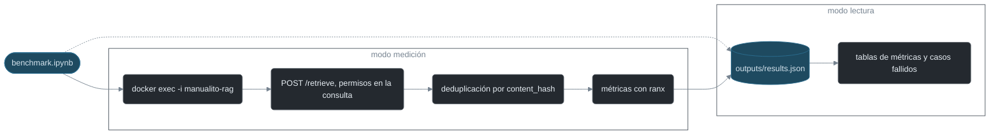

# Benchmark de recuperación RAG

Este benchmark mide si la búsqueda de Manualito devuelve el fragmento correcto del manual. Usa un conjunto dorado de 24 preguntas sobre Catan y Monopoly. Cada pregunta tiene anotado el chunk que contiene su respuesta. El cuaderno `benchmark.ipynb` consulta el servicio RAG real, calcula las métricas con `ranx` y deja los resultados versionados en `outputs/`. Está pensado como anexo reproducible de la memoria del TFG.

La línea base registrada es `recall@5 = 0,7917`, `recall@10 = 0,7917` y `MRR = 0,4979`. Cinco preguntas no recuperan su chunk ni entre los 20 primeros resultados. Tres de ellas son las preguntas reales sobre Monopoly que motivaron la auditoría. Cualquier mejora del buscador se compara contra estos números.



## Ver los resultados sin medir

No hace falta Docker. Abre el cuaderno y ejecuta todas las celdas con la configuración predeterminada:

```python
RUN_BENCHMARK = False
FORCE = False
```

En este modo el cuaderno carga `outputs/results.json`. Las tablas de métricas y los casos fallidos aparecen como salida de celda. Funciona desde la raíz del repositorio y desde `docs/benchmarks/rag/recuperacion/`.

## Repetir la medición

Necesitas el stack levantado y los dos manuales indexados. Desde la raíz, ejecuta esta línea en PowerShell:

```powershell
$env:PYTHONUTF8 = "1"; $env:MANUALITO_RAG_RUN = "1"; uv run --locked --no-default-groups --group benchmarks jupyter execute docs/benchmarks/rag/recuperacion/benchmark.ipynb
```

Si ya existe una medición con la misma configuración, el cuaderno la reutiliza. Para medir de nuevo de todas formas:

```powershell
$env:PYTHONUTF8 = "1"; $env:MANUALITO_RAG_RUN = "1"; $env:MANUALITO_RAG_FORCE = "1"; uv run --locked --no-default-groups --group benchmarks jupyter execute docs/benchmarks/rag/recuperacion/benchmark.ipynb
```

En una sesión interactiva también se puede cambiar `RUN_BENCHMARK = True` directamente. `FORCE = False` evita repetir por defecto un trabajo que ya está hecho.

## Qué mide

Cada pregunta tiene anotado el único chunk que contiene su respuesta. `ranx` calcula tres métricas sobre el ranking devuelto:

| Métrica | Interpretación |
| --- | --- |
| Recall@5 | Proporción de preguntas cuyo chunk esperado aparece entre los 5 primeros. |
| Recall@10 | Proporción de preguntas cuyo chunk esperado aparece entre los 10 primeros. |
| MRR | Media del inverso de la primera posición relevante. Premia encontrar antes la respuesta. |

El informe enumera además todos los fallos de recall@5 con la posición en la que quedó el chunk esperado. Se eligió `ranx` porque sus implementaciones se contrastan con `trec_eval`, la referencia de NIST. Así el cuaderno no mantiene una segunda implementación de evaluación. Como control adicional, cada medición recalcula las métricas por aritmética directa a partir de la posición. Si los valores discrepan, la ejecución aborta.

## Flujo real de recuperación

El servicio RAG no publica su puerto en el host, así que no se puede consultar desde fuera. En lugar de exponer puertos o modificar `compose.yaml`, el cuaderno envía un programa corto por la entrada estándar del contenedor:

```text
docker exec -i manualito-rag python -
```

Se usa el nombre fijo del contenedor por un motivo concreto. Docker Compose deduce el nombre de proyecto del directorio y en los worktrees ese nombre cambia, por lo que `docker compose exec` fallaría. El programa consulta `POST http://127.0.0.1:8002/retrieve` con los manuales autorizados del dataset y pide 20 candidatos. Desde la issue #84 el filtro de permisos se aplica en la propia consulta. Desde la issue #85 la pregunta de búsqueda lleva delante "Manual de {juego}", como hace la API. Desde la issue #86 la búsqueda es híbrida: la pregunta con prefijo alimenta la pata semántica, la cruda alimenta la de palabras exactas y RRF fusiona sus resultados. El programa solo replica la deduplicación por `content_hash` del producto.

Si Docker, el servicio RAG o Chroma fallan, la ejecución termina con `[!] ERROR:` y no persiste nada. Un fallo de infraestructura no debe quedar registrado como si fuera un fallo de relevancia.

## Dataset versionado

`dataset/preguntas.json` contiene las 24 preguntas con su chunk esperado:

- 20 preguntas generadas con `gemma4:e4b` y semilla 7: 14 de Catan y 6 de Monopoly.
- 4 preguntas manuales de la auditoría: 1 de Catan y 3 de Monopoly.

`dataset/manifest.json` registra por pregunta el origen, el juego, el manual, el chunk, el modelo, la semilla y la fecha. También guarda la huella SHA-256 del conjunto. La huella se calcula sobre el JSON parseado, serializado con claves ordenadas, sin espacios y en UTF-8. De este modo un cambio de sangría o de finales de línea no invalida la integridad. Es el caso de los hooks del repositorio, que normalizan los finales de línea.

`dataset/generador.py` prepara candidatos nuevos de forma reproducible. Ordena los chunks antes del muestreo y fija la semilla en Python y en Ollama. No sobrescribe el conjunto curado. Su salida debe revisarse antes de incorporarla. Con el stack levantado se ejecuta así:

```powershell
Get-Content -Raw -Encoding UTF8 docs/benchmarks/rag/recuperacion/dataset/generador.py | docker exec -i manualito-rag python -
```

## Contrato de `outputs/`

| Fichero | Contenido |
| --- | --- |
| `results.json` | Fuente canónica: configuración, métricas, posición del chunk esperado y hasta cinco candidatos por pregunta. |
| `results.md` | Tablas legibles de mediciones, desgloses y casos fallidos. |
| `conclusions.md` | Interpretación breve de la medición más reciente. |

La primera entrada de `results.json` es la línea base histórica de la auditoría y no se modifica. Las mediciones locales son idempotentes: una configuración ya medida se reutiliza y `FORCE` reemplaza solo la entrada local compatible. La auditoría no guardó candidatos, por eso su `top_5` es `null`. Las mediciones nuevas guardan como máximo cinco identificadores por pregunta.

## Límites

- Los identificadores de manual y chunk pertenecen a la instantánea usada para curar el conjunto. Una reingesta que los cambie obliga a revisar el dataset.
- La entrada histórica no conserva candidatos ni revisión Git. Sirve como referencia, no como prueba del estado actual.
- El benchmark evalúa la recuperación. La fidelidad de la respuesta que genera el LLM queda fuera.

## Referencias

- [Documentación de `ranx`](https://amenra.github.io/ranx/): evaluación de rankings. Sus métricas se contrastan con `trec_eval`.
- [`trec_eval`](https://github.com/usnistgov/trec_eval): implementación de referencia de NIST.
- [API de generación de Ollama](https://docs.ollama.com/api/generate): opciones para generar con semilla fija.
- [Serialización JSON de Python](https://docs.python.org/3.13/library/json.html): claves ordenadas y separadores compactos para la huella canónica.
